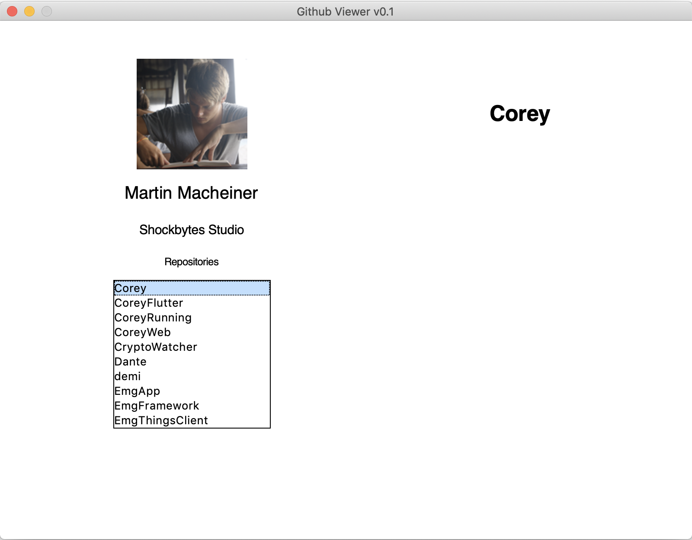

# Github Viewer
This repository is my personal python playground. I never managed to learn 
Python during university, so I decided to write this small app in order to
teach myself Python. The app is fairly simple. It uses the `PyGithub`
library and loads the repository and user information of the signed in user.
The credentials of the user are stored in `data/credentials.json` and look
as follows:
```
{
  "username": "GithubUsername",
  "password": "supersecretpassword_1"
}
```
The goal of this project is to have a small UI which allows the user to see
the see his or her Github profile and eventually see a commit tree for each
repository. 

### Version 0.1

Capabilities: 
* Load username, company and avatar url
* List repositories
* Load commits of repository

### Screenshot

